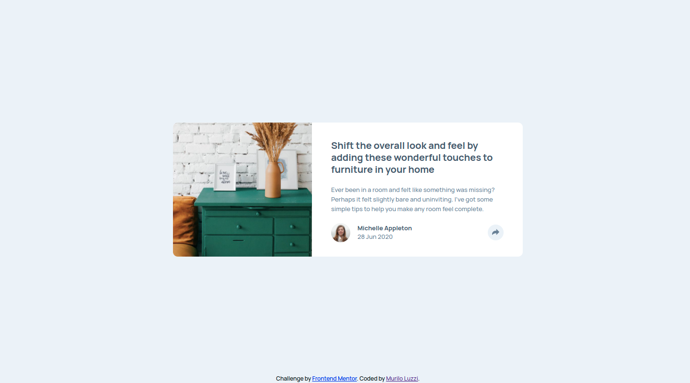

# Frontend Mentor - Article preview component solution

This is a solution to the [Article preview component challenge on Frontend Mentor](https://www.frontendmentor.io/challenges/article-preview-component-dYBN_pYFT). Frontend Mentor challenges help you improve your coding skills by building realistic projects.

## Table of contents

- [Overview](#overview)
  - [The challenge](#the-challenge)
  - [Screenshot](#screenshot)
  - [Links](#links)
- [My process](#my-process)
  - [Built with](#built-with)
  - [What I learned](#what-i-learned)
  - [Continued development](#continued-development)
- [Author](#author)

## Overview

### The challenge

Users should be able to:

- View the optimal layout for the component depending on their device's screen size
- See the social media share links when they click the share icon

### Screenshot

### Links

- Solution URL: [Repository](https://github.com/mlzzi/article-preview-component-master)
- Live Site URL: [Click Here](https://mlzzi.github.io/article-preview-component-master/)

## My process

### Built with

- Semantic HTML5 markup
- CSS custom properties
- Flexbox
- Sass
- BEM

### What I learned

First time using Sass. I liked a lot because it makes the project cleaner and better to work with.
I've done a step ahead using javascript in the share button. A simple usage, but was nice to do it. Looking forward to use React Js.

### Continued development

I will continue to use Javascript and as soon I think that I understand it better well I'll start to learn and build stuff with React JS.

## Author

- Website - [Murilo Luzzi](https://www.linkedin.com/in/muriloluzzi/)
- Frontend Mentor - [@mlzzi](https://www.frontendmentor.io/profile/mlzzi)
